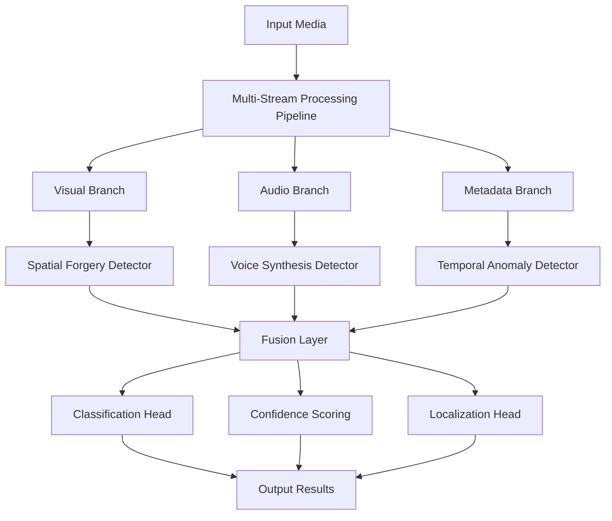

# Deepfake Detection & Media Authenticity Analyzer

## Project Overview Document

---

## 1. Executive Summary

This project implements an **Advanced AI/ML System** for detecting and analyzing deepfake images and videos with high accuracy under real-world conditions. The system is designed as a modular, multi-modal detection framework that combines multiple detection strategies to provide robust authentication.

### Key Deliverables

| Component | Platform | Description |
|-----------|----------|-------------|
| **Model Training** | Google Colab | All AI/ML models trained and exported |
| **Web Application** | Local/Cloud | FastAPI backend + React frontend |
| **Pretrained Models** | Hugging Face | Leverage existing state-of-the-art models |
| **Custom Models** | Colab-trained | Forensic classifiers, face detectors |

---

## 2. System Architecture


### 2.1 Input Processing
The system accepts four types of input:
- **Video Input**: MP4, AVI, MOV, WebM formats
- **Audio Input**: WAV, MP3, extracted from videos
- **Metadata Input**: EXIF, file properties, creation timestamps
- **Image Input**: JPEG, PNG, WebP formats

### 2.2 Multi-Stream Processing Pipeline



### 2.3 Detection Modules

| Module | Responsibility | Models/Techniques |
|--------|---------------|-------------------|
| Visual Analysis | Image-level deepfake detection | EfficientNet-B4, ViT, DCT Analysis |
| Temporal Analysis | Video frame consistency | 3D CNN, Optical Flow |
| Audio-Visual Sync | Lip-sync verification | SyncNet, RawNet2 |
| Metadata Forensics | Authenticity verification | EXIF Parsing, Noise Analysis |

---

## 3. Output Schema

Every analysis produces a standardized output:

```json
{
  "media_id": "uuid",
  "analysis_type": "image|video|audio",
  "classification": {
    "label": "AUTHENTIC|MANIPULATED|SUSPICIOUS",
    "confidence": 0.0-1.0,
    "risk_score": 0-100
  },
  "signals": {
    "visual": {"score": 0.85, "weight": 0.4},
    "forensic": {"score": 0.72, "weight": 0.3},
    "temporal": {"score": 0.91, "weight": 0.2},
    "audio": {"score": 0.68, "weight": 0.1}
  },
  "localization": {
    "regions": [{"x": 120, "y": 80, "w": 200, "h": 200, "confidence": 0.92}],
    "heatmap_path": "/results/heatmap_uuid.png"
  },
  "explanation": {
    "primary_factors": ["facial_artifacts", "noise_inconsistency"],
    "detailed_report": "..."
  },
  "metadata": {
    "processing_time_ms": 1250,
    "model_versions": {...}
  }
}
```

---

## 4. Technology Stack

### 4.1 Model Training (Google Colab)

| Component | Technology |
|-----------|-----------|
| Framework | PyTorch 2.0+ |
| GPU | NVIDIA T4/A100 (Colab) |
| Experiment Tracking | Weights & Biases |
| Model Export | ONNX, TorchScript |
| Datasets | FaceForensics++, Celeb-DF, DFDC |

### 4.2 Web Application (Antigravity)

| Component | Technology |
|-----------|-----------|
| Backend | FastAPI (Python 3.10+) |
| Frontend | React 18 + TypeScript |
| Inference | ONNX Runtime / PyTorch |
| Database | PostgreSQL / SQLite |
| Caching | Redis |
| File Storage | Local / S3-compatible |

---

## 5. Project Structure

```
Deepway/
├── project_documentation/      # All planning documents
│   ├── 00_project_overview.md
│   ├── 01_colab_training_guide.md
│   ├── 02_webapp_implementation.md
│   ├── 03_model_specifications.md
│   ├── 04_dataset_guide.md
│   ├── 05_api_specifications.md
│   └── 99_agent_handoff.md
│
├── training/                   # Colab notebooks (reference)
│   ├── notebooks/
│   │   ├── 01_data_preprocessing.ipynb
│   │   ├── 02_visual_detector_training.ipynb
│   │   ├── 03_forensic_classifier.ipynb
│   │   ├── 04_audio_detector.ipynb
│   │   └── 05_model_export.ipynb
│   └── scripts/
│
├── backend/                    # FastAPI application
│   ├── app/
│   │   ├── main.py
│   │   ├── api/
│   │   ├── models/
│   │   ├── services/
│   │   └── utils/
│   ├── models/                 # Trained model files
│   └── requirements.txt
│
├── frontend/                   # React application
│   ├── src/
│   │   ├── components/
│   │   ├── pages/
│   │   ├── services/
│   │   └── utils/
│   └── package.json
│
└── tests/
    ├── test_visual_detector.py
    ├── test_audio_detector.py
    └── test_api_endpoints.py
```

---

## 6. Implementation Phases

### Phase 1: Planning & Documentation (Current)
- [x] Project architecture design
- [x] Documentation creation
- [ ] User approval

### Phase 2: Colab Model Training
- Duration: 2-3 weeks
- Platform: Google Colab Pro (recommended)
- Output: Trained models in ONNX/TorchScript format

### Phase 3: Web Application Development
- Duration: 2-3 weeks
- Platform: Local development with Antigravity
- Output: Functional web application

### Phase 4: Integration & Testing
- Duration: 1 week
- Combined testing of all components
- Performance optimization

---

## 7. Key Design Principles

> [!IMPORTANT]
> **System-level robustness over single-model accuracy**
> 
> The project deliberately avoids a monolithic "one model solves all" approach.

1. **Ensemble of Heterogeneous Signals**: Multiple independent detectors contribute to final decision
2. **Explainability First**: Every prediction includes reasoning
3. **Calibrated Confidence**: Never output binary decisions without confidence scores
4. **Adversarial Robustness**: Training includes adversarial examples
5. **Real-world Constraints**: Handle compression, resolution variations, diverse formats

---

## 8. Success Criteria

| Metric | Target |
|--------|--------|
| Image Detection Accuracy | >85% on FaceForensics++ |
| Video Detection Accuracy | >80% on DFDC |
| Inference Time (Image) | <500ms |
| Inference Time (Video/min) | <30s |
| False Positive Rate | <10% |

---

## 9. Next Steps

1. **Review this documentation** and provide feedback
2. **Proceed to Colab training** using `01_colab_training_guide.md`
3. **Build web application** using `02_webapp_implementation.md`
4. **Handoff to automation** using `99_agent_handoff.md`

---

## 10. Related Documents

- [Colab Training Guide](file:///d:/Deepway/project_documentation/01_colab_training_guide.md)
- [Web App Implementation](file:///d:/Deepway/project_documentation/02_webapp_implementation.md)
- [Model Specifications](file:///d:/Deepway/project_documentation/03_model_specifications.md)
- [Dataset Guide](file:///d:/Deepway/project_documentation/04_dataset_guide.md)
- [API Specifications](file:///d:/Deepway/project_documentation/05_api_specifications.md)
- [Agent Handoff Document](file:///d:/Deepway/project_documentation/99_agent_handoff.md)
